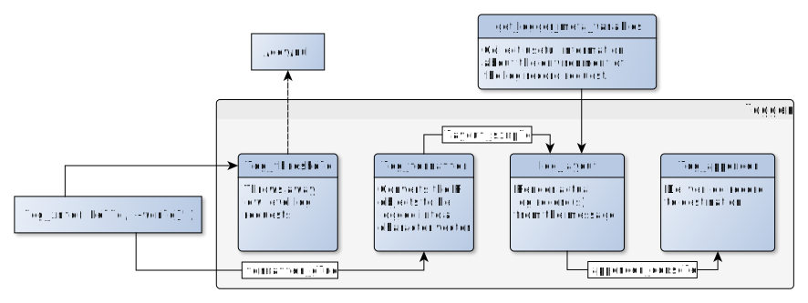

```{r setup, include = FALSE}
knitr::opts_chunk$set(
    collapse = TRUE,
    comment = "#>"
)
library(logger)
## backup settings
oldconf <- list(
    threshold = log_threshold(),
    layout = log_layout(),
    formatter = log_formatter(),
    appender = log_appender())
## knitr not picking up stderr
log_appender(appender_stdout)
```

```{r loggerStructureImage, echo=FALSE, out.extra='style="width: 100%;" title="The structure of a logger and the flow of a log record request" alt="The structure of a logger and the flow of a log record request"'}

```

To make a successful log record, `logger` requires the below components:

- a **log request**, eg

    ```r
    log_error('Oops')
    ```

    - including the log level (importance) of the record, which will be later used to decide if the log record is to be delivered or not: `ERROR` in this case
    - R objects to be logged: a simple string in this case, although it could be a character vector or any R object(s) that can be converted into a character vector by the `formatter` function

- the **environment** and meta-information of the log request, eg actual timestamp, hostname of the computer, the name of the user running the R script, the pid of the R process, calling function and the actual call etc.


    ```{r}
    f <- function() get_logger_meta_variables(log_level = INFO)
    f()
    ```

- a **logger definition** to process the log request, including

    - log level `threshold`, eg `INFO`, which defines the minimum log level required for actual logging -- all log requests with lower log level will be thrown away

        ```{r}
        log_threshold()
        ERROR <= INFO
        log_error('Oops')
        ```

    - `formatter` function, which takes R objects and converts those into actual log message(s) to be then passed to the `layout` function for the log record rendering -- such as `paste`, `sprintf`, `glue` or eg the below custom example:


        ```{r}
        formatter <- function(...) paste(..., collapse = ' ', sep = ' ')
        formatter(1:3, c('foo', 'bar'))
        ```

    - `layout` function, which takes log message(s) and further information on the log request (such as timestamp, hostname, username, calling function etc) to render the actual log records eg human-readable text, JSON etc


        ```r
        library(jsonlite)
        layout <- function(level, msg) toJSON(level = level, timestamp = time, hostname = node, message = msg)
        layout(INFO, 'Happy Thursday!')
        #> {'level': 'INFO', 'timestamp': '1970-01-01 00:00:00', 'hostname': 'foobar', 'message': 'Happy Thursday!'}
        ```

    - `appender` function, which takes fully-rendered log record(s) and delivers to somewhere, eg `stdout`, a file or a streaming service, eg

        ```{r}
        appender <- function(line) cat(line, '\n')
        appender('INFO [now] I am a log message')
        ```

Putting all these together (by explicitly setting the default config in the `global` namespace):

```{r}
log_threshold(INFO)
log_formatter(formatter_glue)
log_layout(layout_simple)
log_appender(appender_console)
log_debug('I am a low level log message that will not be printed with a high log level threshold')
log_warn('I am a higher level log message that is very likely to be printed')
```

Note, that all `logger` definitions and requests are tied to a logging namespace, and one log request might trigger multiple `logger` definitions as well (stacking). Find more information on these in the [Customizing the format and destination of log records](https://daroczig.github.io/logger/articles/customize_logger.html) vignette.

```{r cleanup, include = FALSE}
## restore settings
log_threshold(oldconf$threshold)
log_layout(oldconf$layout)
log_formatter(oldconf$formatter)
log_appender(oldconf$appender)
```
